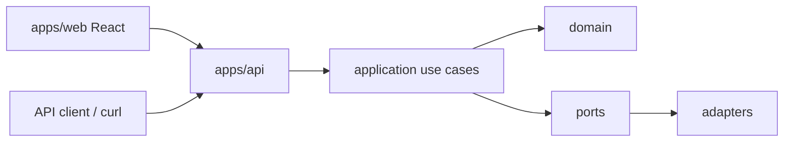

# JobRadar

Local-first **Personal Job Intelligence Platform** for software-engineering job discovery and application support.

JobRadar crawls approved company career pages, normalizes openings into a canonical job model, scores them against your profile, and surfaces high-signal recommendations — with draft application help, tracking, and alerts. Outbound send/submit always stays under human control.

## Goals

- Reduce manual career-page checking across many companies
- Keep a single canonical view of each opportunity (dedup + lifecycle)
- Prefer **precision over recall**: only actionable, explainable matches
- Support drafting (messages, CV notes, interview prep) without auto-sending
- Notify via channel adapters (in-app + email recording in v1)
- Operate the platform from a local **React dashboard** (`apps/web`)

**v1 role focus:** junior → mid software roles (backend, fullstack, platform/AI-adjacent), with stack bias toward Python/FastAPI, TypeScript/Node, C++/C#/.NET, and PostgreSQL.

## Architecture

JobRadar follows **Clean Architecture (ports & adapters)** with strict inward dependencies:

```text
apps/api          → interfaces (HTTP)
apps/web          → React dashboard (Epic 6)
src/application   → use cases / orchestration
src/domain        → entities, policies, validation
src/ports         → contracts (repositories, crawlers, notifications, telemetry)
src/adapters      → in-memory persistence, crawler plugins, notification channels, observability
```



### Design invariants (short)

- **Domain** has no framework/infrastructure deps
- **Mutations** go through use cases only
- **Crawlers** are plugin-isolated per career source (one failure does not kill the run)
- **Recommendations** are deterministic and policy/config driven
- **Explainability** is required for AI-derived actionable outputs
- **Human-in-the-loop** for anything outbound
- **Notifications** are channel-neutral payloads + `NotificationChannelAdapter`s
- **API envelope:** `{ "data": ..., "error": ..., "meta": ... }`
- Timestamps: UTC ISO-8601; structured logs with correlation IDs

### Pipeline (mental model)

1. Register / approve career sources (compliance gate)
2. Discover → crawl plugin → normalize → dedup → lifecycle
3. Score against user profile → gate → precision top-N → explain
4. Search / bookmark / tracker transitions
5. Generate draft artifacts → approve → deliver (recorded locally)
6. Immediate alerts / morning digest → deliver via notification channels

## Repository layout

```text
apps/api/main.py          FastAPI app + wiring
apps/web/                 React + TypeScript dashboard (Epic 6.1 shell)
src/domain/               Domain models & policies
src/application/          Use cases
src/ports/                Protocols / ports
src/adapters/             Persistence, crawling, notifications, telemetry
tests/                    unit / contract / integration
_bmad-output/             Planning & story artifacts (gitignored locally)
```

**Local usage:**

```bash
# terminal 1 — API
uv run uvicorn apps.api.main:app --reload --host 127.0.0.1 --port 8000

# terminal 2 — web
cd apps/web
cp .env.example .env   # first time only; default VITE_API_BASE_URL=/api (Vite proxy)
npm install
npm run dev
```

Open http://127.0.0.1:5173. The shell header shows API connection status via `GET /api/career-sources` (proxied to port 8000). `/sources`, `/opportunities`, `/tracker`, `/drafts`, `/alerts`, and `/notifications` are live. More detail: `apps/web/README.md`.

API-only docs remain at http://127.0.0.1:8000/docs.

## Requirements

- Python **3.11+**
- [uv](https://docs.astral.sh/uv/) (recommended) or any installer that can sync `pyproject.toml`
- **Node.js 20+** (for `apps/web`)

## Setup

```bash
# from repo root
uv sync
```

This installs runtime deps (FastAPI, Pydantic, Uvicorn) and the `dev` group (pytest, httpx, ruff).

## Run the API

```bash
uv run uvicorn apps.api.main:app --reload --host 127.0.0.1 --port 8000
```

- OpenAPI / Swagger: http://127.0.0.1:8000/docs
- ReDoc: http://127.0.0.1:8000/redoc

Optional request header: `X-Correlation-Id` (defaults to `local`).

## Usage (typical local flow)

All responses use the envelope `{ data, error, meta }`. Examples below assume the server is running on port 8000.

### 1. Career sources & discovery

```bash
# Create a source (then approve compliance before execute)
curl -s -X POST http://127.0.0.1:8000/career-sources \
  -H "Content-Type: application/json" \
  -d "{\"name\":\"Example Careers\",\"base_url\":\"https://example.com/careers\",\"plugin_id\":\"generic\"}"

# List sources
curl -s http://127.0.0.1:8000/career-sources

# Approve compliance, enable, execute one source (or run all discovery)
curl -s -X POST http://127.0.0.1:8000/career-sources/{source_id}/compliance/approve
curl -s -X POST http://127.0.0.1:8000/career-sources/{source_id}/enable
curl -s -X POST http://127.0.0.1:8000/career-sources/{source_id}/execute \
  -H "X-Correlation-Id: demo-1"

curl -s -X POST http://127.0.0.1:8000/discovery/runs -H "X-Correlation-Id: demo-1"
curl -s http://127.0.0.1:8000/job-postings
```

### 2. Profile, scoring, recommendations

```bash
curl -s -X PUT http://127.0.0.1:8000/user-profile \
  -H "Content-Type: application/json" \
  -d "{\"headline\":\"Backend engineer\",\"skills\":[\"Python\",\"FastAPI\"]}"

curl -s -X POST http://127.0.0.1:8000/match-scores/run -H "X-Correlation-Id: demo-2"
curl -s -X POST http://127.0.0.1:8000/recommendations/gating/run -H "X-Correlation-Id: demo-2"
curl -s -X POST http://127.0.0.1:8000/recommendations/precision/run -H "X-Correlation-Id: demo-2"
curl -s -X POST http://127.0.0.1:8000/recommendations/explainability/run -H "X-Correlation-Id: demo-2"

curl -s http://127.0.0.1:8000/recommendations/actionable
curl -s http://127.0.0.1:8000/recommendations/top
```

### 3. Workspace, drafts, outbound

```bash
curl -s -X POST http://127.0.0.1:8000/opportunities/search \
  -H "Content-Type: application/json" \
  -d "{}"

curl -s -X POST http://127.0.0.1:8000/tracker/bookmarks \
  -H "Content-Type: application/json" \
  -d "{\"job_posting_id\":\"...\"}"

curl -s -X POST http://127.0.0.1:8000/draft-artifacts/generate \
  -H "Content-Type: application/json" \
  -d "{\"job_posting_id\":\"...\",\"artifact_type\":\"recruiter_message\"}"

# Explicit approval required before delivery recording
curl -s -X POST http://127.0.0.1:8000/draft-artifacts/{artifact_id}/approve-outbound
curl -s -X POST http://127.0.0.1:8000/outbound/deliver \
  -H "Content-Type: application/json" \
  -d "{\"artifact_id\":\"...\"}"
```

### 4. Alerts, digest, notifications

Generation and delivery are separate steps (channel-neutral artifacts → adapters).

```bash
curl -s -X POST http://127.0.0.1:8000/alerts/immediate/run \
  -H "Content-Type: application/json" \
  -d "{\"run_context\":\"run-1\"}" \
  -H "X-Correlation-Id: alert-1"

curl -s -X POST http://127.0.0.1:8000/digests/morning/run \
  -H "Content-Type: application/json" \
  -d "{\"run_context\":\"2026-08-12\"}" \
  -H "X-Correlation-Id: digest-1"

curl -s -X POST http://127.0.0.1:8000/notifications/deliver \
  -H "Content-Type: application/json" \
  -d "{\"kind\":\"immediate_alert\",\"run_context\":\"run-1\"}" \
  -H "X-Correlation-Id: notify-1"

curl -s http://127.0.0.1:8000/notifications/in-app
curl -s http://127.0.0.1:8000/observability/notification-metrics
```

v1 channels: **`in_app`** (`delivered`) and **`email`** (`recorded` — no SMTP). Pass `"channels": ["in_app"]` (etc.) to limit fan-out.

## API surface (overview)

| Area | Examples |
|------|----------|
| Sources / crawl | `POST/GET /career-sources`, compliance approve/reject, execute, `POST /discovery/runs` |
| Jobs | `GET /job-postings`, lifecycle transitions & metrics |
| Matching | profile, match-scores, gating, precision, explainability |
| Workspace | `POST /opportunities/search`, tracker bookmarks & transitions |
| Drafts / outbound | generate drafts, approve-outbound, deliver, list deliveries |
| Alerts / digest | config + run + list for immediate alerts and morning digests |
| Notifications | deliver, list deliveries, in-app inbox, metrics |
| Observability | `/observability/*-metrics` per pipeline stage |

Full interactive docs: `/docs` when the API is running.

## Development

```bash
# tests
uv run pytest

# lint
uv run ruff check .
```

Test layout:

- `tests/unit` — domain / use-case behavior
- `tests/contract` — adapter/port contracts
- `tests/integration` — HTTP API flows via `create_app(...)`

## Design principles worth knowing

1. **Local-first** — designed to run on your machine; external sends are recorded stubs in v1
2. **Compliance before crawl** — sources need approval; plugins are rate-limited / least-intrusive by design
3. **Precision > recall** — gating and top-N policy keep noisy matches out of actionable views
4. **Extensible channels** — new notification providers register as adapters; orchestration stays provider-agnostic

## License

Private / personal project unless otherwise stated.
